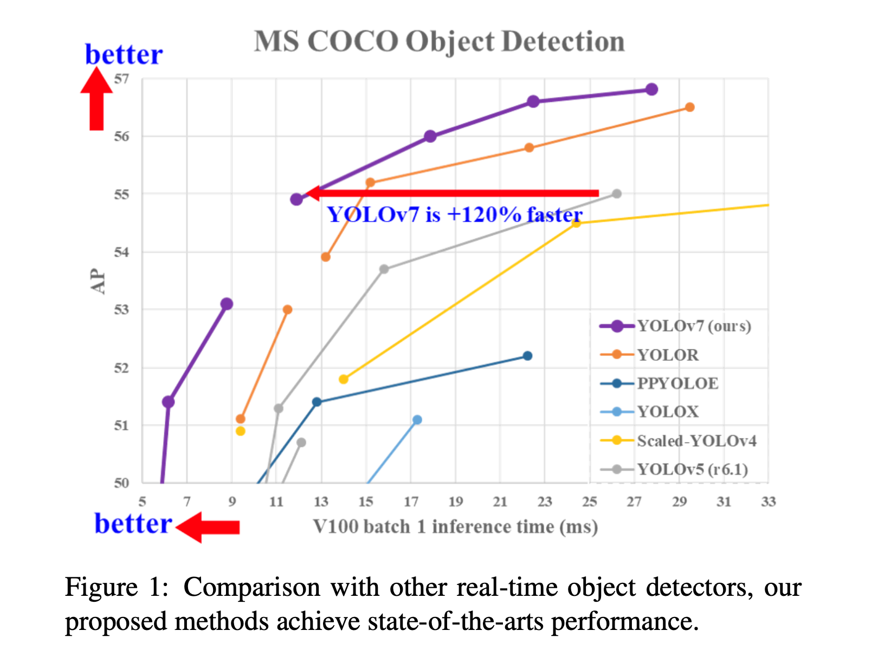
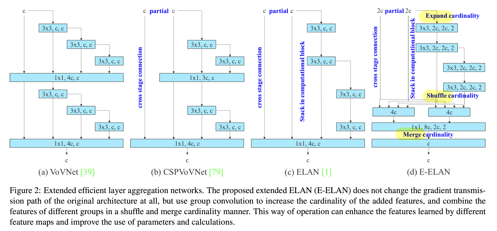

# YOLOv7: Trainable bag-og-greebies sets new state-of-the-art for real-time object detectors

## Abstract
(yolov7라는 용감한 타이틀을 단 이 논문은 yolov4의 저자가 발표하였다.\
yolov4 발표당시에도 왜 yolo라는 이름을 사용하느냐는 이야기가 많았던 것으로 기억하는데,,,\
아무튼 이번에는 yolov7 이름으로 논문을 발표하였고, 이와 별개로 yolov7의 이름을 가진 github project repo가 있었던 것 같은데 해당 repo는 yolovn이라는 
이름으로 이동? 한다고 하는 것 같다)

yolov7은 5FPS ~ 160FPS 사이의 일명 real-time object detectors에서 SOTA성능을 달성하였다.\
즉 transformer-based detector (요즘 핫했던 것으로 알고 있다) 와 convolutional based detector에 비해서 속도와 성능 모두 향상을 했다.\
소스 코드도 공개되어 있다.\
<https://github.com/WongKinYiu/yolov7>

yolo 계열의 논문마다 전통적으로 보여주는 성능 그래프에서 yolov7이 다른 모델에 비해서 높은 성능을 보여주고 있다.\
특히 많이들 사용하는 yolov5에 비해서 약 0.02 (or 2%) AP 향상이 있는 것으로 보인다. 

## Introduction
Real-time object detection은 computer vision에서 매우 중요하고, 최근 이러저러한 연구로 많이 발전하였다.\
하지만 yolov7은 기존의 방법들과는 다르게 architecture의 optimization에 더해서 training process의 optimization까지 집중해보았다.\
이렇게 inference cost의 증가 없이 성능향상을 할 수 있는 강점을 방법들을 trainable bag-of-freebies라고 해서 제안한다.\

(bag-of-freebies는 yolov4를 발표하면서 이야기한 inference 비용을 늘리지 않고 정확도를 향상시키는 방법으로 알고 있는데, 이번 논문은 역시 해당 논문의 
방향성을 가지고 있는 것 같다.\
자세한 내용은 yolov4를 읽지 않아서 다음 기회에,,)

그리고 최근 model re-parameterization과 dynamic label assignment가 중요한 topic인데, 이 두가지 주제에 대해서 각각 planned re-prameterized model과 coarse-to-fine lead guided label assignment를 제안한다.

정리해서 이 논문의 contributions는 다음과 같다.\
1) inference cost를 증가하지 않으면서 성능을 향상시키는 여러가지 trainable bag-of-freebies 방법들을 제안한다.\
2) 기존의 re-parameterized module과 dynamic label이 가진 어려움을 극복하기 위한 방법을 제안한다. (planned re-parameterized model & 
3) coarse-to-fine lead guided label assignment)
4) parameters와 computation을 효과적으로 활용하기 위한 extend, compound scaling 방법을 제안한다.\
5) 약 기존 SOTA real-time object detector 대비해서 40%정도의 parameters 와 computation을 줄이고 더 빠른 추론속도와 탐지 성능을 달성한다.\

## Related work ([skip하고 본문으로](#architecture))
### Real-time object detectors
SOTA급 Real-time object detection 모델은 
1) 더 빠르고 강한 네트워크 구조, 
2) 더 효과적인 feature integration 방법, 
3) 더 정확한 detection 방법, 
4) 더 robust한 loss function, 
5) 더 효율적인 label assignment 방법, 그리고 
6) 더 효율적인 학습 방법이 필요하다. \
이 논문에서는 추가적인 데이터가 large model이 필요한 self-supervised learning이나 knowledge distillation 같은 방법이 아니라 4), 5), 6)에 연관된 새로운 trainable bag-of-freebies를 제안한다.
### Model re-parameterization
model re-parametrization 기술의 경우 여러 computational modules를 추론단계에서 하나로 합치는 것으로, ensemble 테크닉으로 간주할 수 있다.\
때문에 이는 module-lebel ensemble과 model-level ensemble로 나눌 수 있다. model-level의 re-parameterization은 대표적으로 독립적인 다수의 모델을 여러 학습 데이터로 학습해 여러 학습 모델의 weights를 평균내는 방법과, 다른 iteration number에서의 모델 weights를 weighted average하는 방법이 있다.\
Module level의 reparameterization이 최근에는 더 주목받고 있는데, 이는 하나의 module을 여러 module branches로 학습 단계에 나누고 추론단계에서 완전히 평등한 하나의 module로 통합한다. (이 부분의 배경 지식이 없어서 정확하게 이해되지 않는다,,)\
하지만 이런 방법들은 여러 가지 다른 모델 구조에 환벽하게 적용하기 어렵다는 한계점이 있어서, 이부분을 극복할 수 있는 새로운 re-parameterization module을 제안한다.
### Model scaling
모델 scaling은 여러 computing devices에 맞도록 사전에 설계된 모델을 scale up 하거나 down하는 방법이다. 이때 여러가지 scaling factors를 사용하는데 주로 이미지 resolution, layer depth, 채널 width, stage (number of feature pyramid) 를 사용한다. Network architecture search (NAS) \
가 주로 사용되는 model scaling 방법인데, 이 방법은 scaling factor를 search하는데 많은 computation이 요구되는 단점이 있다. (이후 scaling factor와 parameter의 amount와의 관계성에 대하여 말한 부분이 있는데, 정확하게 이해하지 못함. 관련 논문 확인해 볼 것 - Fast and accurate model scaling - 2021 CVPR)

## Architecture
### Extended dfficient layer aggregation networks
대부분의 efficient architectures 관련한 연구에서는 주로 parameter의 숫자, computation의 양, 그리고 computational density을 다룬다.\

위 그림의 VoVNe (a)는 그러한 기본적인 설계 컨셉을 고려하였고, CSPVoVNet (b)는 거기에 더해 gradient path 분석을 통해 다른 layers에 weights를 부여하여 더 다양한 features를 학습 할 수 있도록 하였다. \
이는 곧 더 빠르고 정확한 inference를 가능하게 했다. 
ELAN (c)의 경우에는 가장 짧고 긴 gradient path의 controlling을 통해서 더 요휼적인 네트워크를 구성하는 방법을 제안하였다. (computational blocks를 stacking ?) 
이 논문에서는 ELAN를 based하는 Extended-ELAN (d) 를 제안한다.
만약 제한없이 computational blocks가 stacked 된다면, 이는 stable state를 파괴하고, 파라미터 활용 rate를 낮추게 된다. 
E-ELAN은 cardinality (of gradient path?)의 expand, shuffle, merge를 통해서 원래의 gradient path를 무너뜨리지 않고도 네트워크의 학습 능력을 강화한다.
* Expand: group convolution을 이용해서 computational block의 channel과 cardinality를 확장한다
* Shuffle: 각각의 computational block에서 계산된 feature map이 g개의 그룹으로 shuffled되고 concatenate 된다. 
* Merge: 그리고 g개 그룹의 feature map을 더해서 cardinality를 merge한다.
(비교하는 CSPVoVNet, ELAN의 구조를 알아야 정확히 이해 가능할 듯)
### Model scaling for concatenation-based models
(EfficientNet은 width, depth, resolution을 scaling에 고려하였고, scaled Yolov4에서는 number of stages를 고려하였다.)
PlainNet이나 ResNet의 경우에 scaling up or down을 수행해도 각 layer의 입출력 차원이 변하지 않기 때문에, 각 scaling factor가 parameters와 computation에 미치는 영향을 독립적으로 확인할 수 있다.\
하지만 이러한 방법들을 concatenation-based 구조에 적용하는 경우에는 scaling up or down시에 concatenation-based computational block 이후에 translation layer의 차원이 증가하거나 줄어드는 것을 확인할 수 있다.\
아래 그림 (a, b) 참고,,

예를 들어서, 모델의 depth를 scaling-up하는 경우에는 transition layer의 input, output channel이 변하게 되고, 이것이 모델의 hardware usage를 줄이게 된다.\
그렇기 때문에 이 모델에서는 concatenation-based 모델을 위한 compound (합성?) 모델 scaling method를 위의 그림 (c)와 같이 제안한다.\
이런 방법은 모델이 가지고 있는 initial design과 optimal structure를 유지할 수 있다.

## Trainable bag-of-freebies
### 

